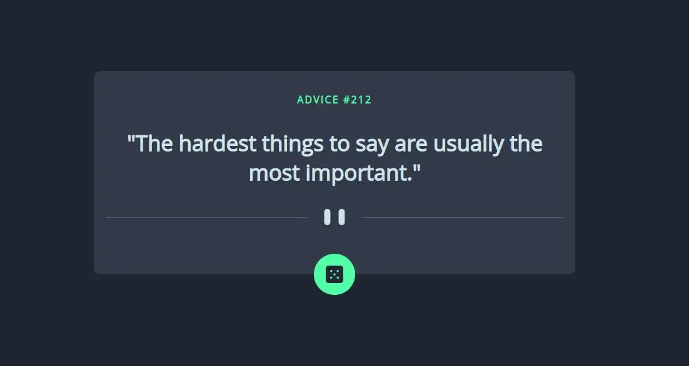
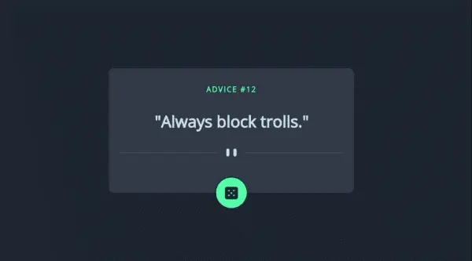

# Frontend Mentor - Advice generator app challenge

This is a solution to the [Advice generator app challenge on Frontend Mentor](https://www.frontendmentor.io/challenges/advice-generator-app-QdUG-13db). Frontend Mentor challenges help you improve your coding skills by building realistic projects.

## Table of contents

- [Overview](#overview)
  - [The challenge](#the-challenge)
  - [Screenshot](#screenshot)
  - [Links](#links)
- [My process](#my-process)
  - [Built with](#built-with)
  - [What I learned](#what-i-learned)
- [Author](#author)

## Overview

I wanted a project that combines JS, API, CSS and HTML. I had decided to do it within 90min, it took me exactly 90min.

### The challenge

Users should be able to:

- View the optimal layout for the app depending on their device's screen size
- See hover states for all interactive elements on the page
- Generate a new piece of advice by clicking the dice icon

### Screenshot




### Links

- Repository: [GitHub](https://github.com/Poukame/ALL-my-Front-End-Mentor-Challenge/tree/main/FEM%20-%20advice-generator-app-main)
- Live Site URL: [My live site of the challenge](https://fem-advice-gen.netlify.app/)

## My process

The design was pretty straightforward since the layout between desktop and mobile doesn't differ much.

So I did the whole design and then coded to the JavaScript. It was a good reminder on API which I learned last week and the use of async/await.

### Built with

- API fetch
- JavaScript
- HTML5
- CSS3
- Flexbox
- Mobile-first workflow

### What I learned

I learned how to set the image source from the CSS. In the case of this project it was useful to use this because the divider SVG was changing depending on screen size.

In the JavaScript, I learned how to return 2 variables at once and then pass them into another function with the spread operator.

```css
.divider {
  content: url('/images/pattern-divider-mobile.svg');
}
```


## Author

- GitHub - [Poukame](https://github.com/Poukame)
- Frontend Mentor - [@Poukame](https://www.frontendmentor.io/profile/Poukame)
- LinkedIn - [Guillaume](https://www.linkedin.com/in/theretg)

