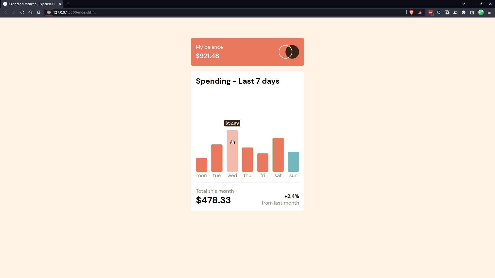

# Frontend Mentor - Expenses chart component solution

This is a solution to the [Expenses chart component challenge on Frontend Mentor](https://www.frontendmentor.io/challenges/expenses-chart-component-e7yJBUdjwt). Frontend Mentor challenges help you improve your coding skills by building realistic projects. 

## Table of contents

- [Overview](#overview)
  - [The challenge](#the-challenge)
  - [Screenshot](#screenshot)
  - [Links](#links)
- [My process](#my-process)
  - [Built with](#built-with)
  - [What I learned](#what-i-learned)
- [Author](#author)

## Overview

This is my 3rd project on Front-End mentor. I wanted to consolidate my use of flexbox before starting to learn grid.
### The challenge

Users should be able to:

- View the bar chart and hover over the individual bars to see the correct amounts for each day
- See the current day’s bar highlighted in a different colour to the other bars
- View the optimal layout for the content depending on their device’s screen size
- See hover states for all interactive elements on the page
- **Bonus**: Use the JSON data file provided to dynamically size the bars on the chart

### Screenshot

### Links

- Live Site URL: [My live site of the challenge](https://cosmic-donut-fbde9c.netlify.app/)

## My process

I use the mobile first approach. I focused on the typography then the top part and the bottom part.

Once everything was ok, I worked on the chart with flexbox and relative positioning.

Finally, I created the JavaScript in order to generate the bar and tooltip dynamically.

### Built with

- HTML5
- CSS3
- Flexbox
- Mobile-first workflow

### What I learned

I learned use the relative/absolute properties on element to place them properly.

It was a good practice of flexbox.

I learn how to import a JSON file from local computer. It doesn't work on the live site because the code is based on my local host.

## Author

- GitHub - [Poukame](https://github.com/Poukame)
- Frontend Mentor - [@Poukame](https://www.frontendmentor.io/profile/Poukame)
- LinkedIn - [Guillaume](https://www.linkedin.com/in/theretg)

