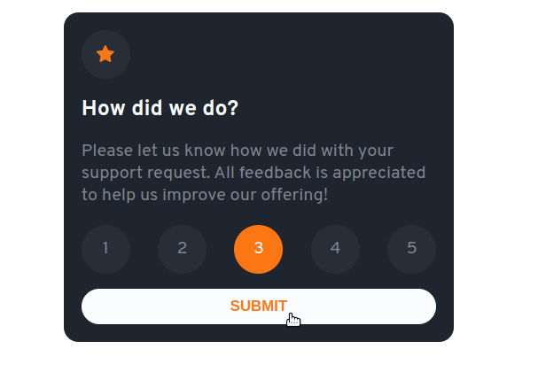

# Frontend Mentor - Interactive rating component solution

This is a solution to the [Interactive rating component challenge on Frontend Mentor](https://www.frontendmentor.io/challenges/interactive-rating-component-koxpeBUmI). Frontend Mentor challenges help you improve your coding skills by building realistic projects. 

## Table of contents

- [Overview](#overview)
  - [The challenge](#the-challenge)
  - [Screenshot](#screenshot)
  - [Links](#links)
- [My process](#my-process)
  - [Built with](#built-with)
  - [What I learned](#what-i-learned)
- [Author](#author)

## Overview

This is my 1st project on Front-End mentor. I wanted to consolidate my use of flexbox before starting to learn grid.
### The challenge

Users should be able to:

- View the bar chart and hover over the individual bars to see the correct amounts for each day
- See the current day’s bar highlighted in a different colour to the other bars
- View the optimal layout for the content depending on their device’s screen size
- See hover states for all interactive elements on the page
- **Bonus**: Use the JSON data file provided to dynamically size the bars on the chart

### Screenshot

### Links

- GitHub : [GitHub Code](https://github.com/Poukame/Front-End-Mentor-Challenges/tree/main/FEM%20-%20interactive-rating-component-main)
- Live Site URL: [My live site of the challenge](https://relaxed-meerkat-1c08eb.netlify.app/)

### Built with

- HTML5
- CSS3
- Flexbox
- Mobile-first workflow

### What I learned

Very interesting challenge.
The design itself is ok. The challenge was in the active states and interactivity in the Javascript.
I learned to use querySelectorAll in combination with forEach loop to quickly assign eventListener or class.

## Author

- GitHub - [Poukame](https://github.com/Poukame)
- Frontend Mentor - [@Poukame](https://www.frontendmentor.io/profile/Poukame)
- LinkedIn - [Guillaume](https://www.linkedin.com/in/theretg)