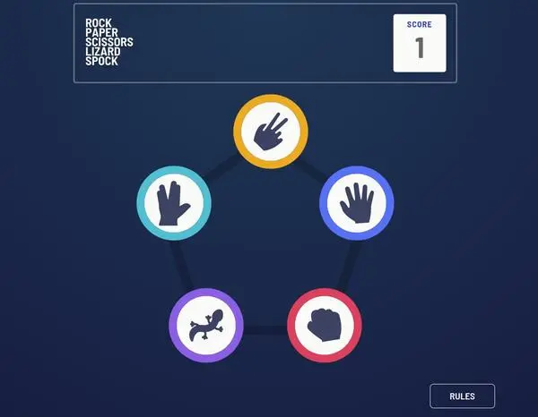
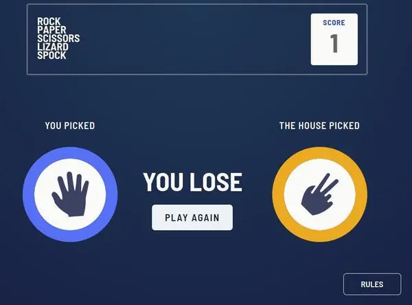
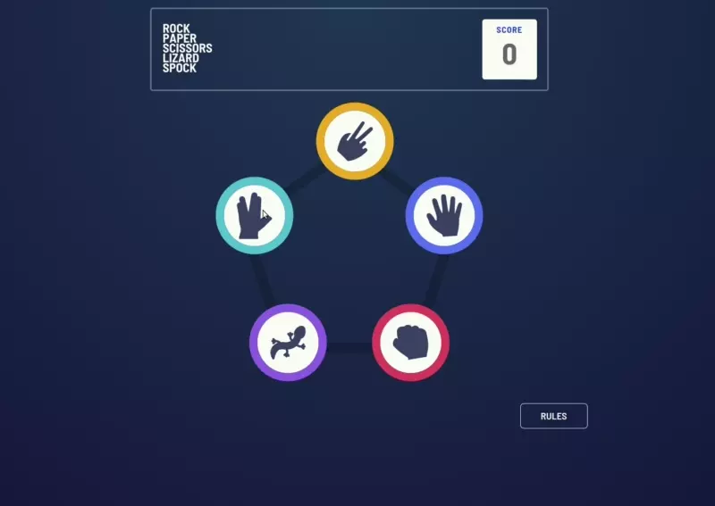

# Frontend Mentor - Rock, Paper, Scissors

This is a solution to the [Rock, Paper, Scissors challenge on Frontend Mentor](https://www.frontendmentor.io/challenges/rock-paper-scissors-game-pTgwgvgH)

## Table of contents

- [Overview](#overview)
  - [The challenge](#the-challenge)
  - [Screenshot](#screenshot)
  - [Links](#links)
- [My process](#my-process)
  - [Built with](#built-with)
  - [What I learned](#what-i-learned)
- [Author](#author)

### The challenge

Users should be able to:

- View the optimal layout for the game depending on their device's screen size
- Play Rock, Paper, Scissors against the computer
- Play Rock, Paper, Scissors, Lizard, Spock against the computer _(optional)_

### Screenshot

### Links

- GitHub : [GitHub Code](https://github.com/Poukame/Front-End-Mentor-Challenges/tree/main/FEM%20-%20rock-paper-scissors)
- Live Site URL: [My live site of the challenge](https://earnest-scone-74f52a.netlify.app/)

### Built with

- React
- TypeScript
- Vite
- Chakra UI
- Mobile-first workflow

## Author

- GitHub - [Poukame](https://github.com/Poukame)
- Frontend Mentor - [@Poukame](https://www.frontendmentor.io/profile/Poukame)
- LinkedIn - [Guillaume](https://www.linkedin.com/in/theretg)
