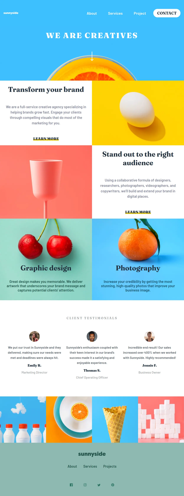
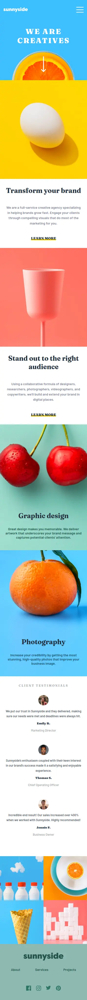

# Frontend Mentor - NFT preview card component

This is a solution to the [Sunnyside agency landing page challenge on Frontend Mentor](https://www.frontendmentor.io/challenges/sunnyside-agency-landing-page-7yVs3B6ef). Frontend Mentor challenges help you improve your coding skills by building realistic projects.

## Table of contents

- [Overview](#overview)
  - [The challenge](#the-challenge)
  - [Screenshot](#screenshot)
  - [Links](#links)
- [My process](#my-process)
  - [Built with](#built-with)
  - [What I learned](#what-i-learned)
- [Author](#author)

## Overview

With this project I wanted to consolidate try a larger project and make use of CSS grid a bit more to get comfortable with it.
### The challenge

Users should be able to:

- View the optimal layout for the site depending on their device's screen size
- See hover states for all interactive elements on the page

### Screenshot

### Links

- GitHub : [GitHub Code](https://github.com/Poukame/ALL-my-Front-End-Mentor-Challenge/tree/main/FEM%20-%20sunnyside-agency-landing-page)
- Live Site URL: [My live site of the challenge](https://fem-sunnyside-ag.netlify.app/)

## My process

I use the mobile first approach. I focused on the typography first.

I struggled with the SVG images, for some reason the fill property wasn't working. I haven't figured out why.

### Built with

- HTML5
- CSS3
- Flexbox
- Grid
- JS for the menu
- Mobile-first workflow

### What I learned

I learned to do the mobile menu, it was my first one from scratch.

It was a good practice on grid and responsiveness on a full landing page.

## Author

- GitHub - [Poukame](https://github.com/Poukame)
- Frontend Mentor - [@Poukame](https://www.frontendmentor.io/profile/Poukame)
- LinkedIn - [Guillaume](https://www.linkedin.com/in/theretg)

