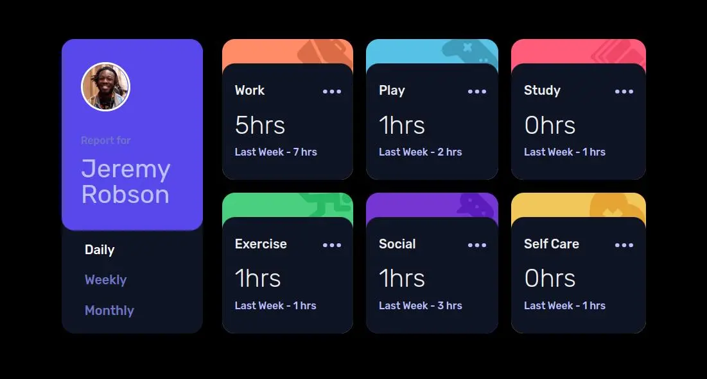
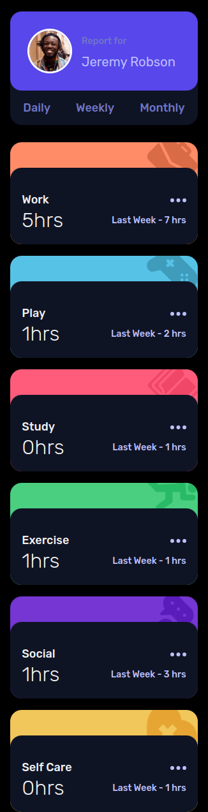

# Frontend Mentor - Time tracking dashboard solution

This is a solution to the [Time tracking dashboard challenge on Frontend Mentor](https://www.frontendmentor.io/challenges/time-tracking-dashboard-UIQ7167Jw). Frontend Mentor challenges help you improve your coding skills by building realistic projects. 

## Table of contents

- [Overview](#overview)
  - [The challenge](#the-challenge)
  - [Screenshot](#screenshot)
  - [Links](#links)
- [My process](#my-process)
  - [Built with](#built-with)
  - [What I learned](#what-i-learned)
- [Author](#author)

## Overview

I wanted a project that'd allowed me to practice React interactivity (useState) and Props. But I also wanted a layout that would require the use of CSS grid. This project looked perfect in that regard.

### The challenge

Users should be able to:

- View the optimal layout for the site depending on their device's screen size
- See hover states for all interactive elements on the page
- Switch between viewing Daily, Weekly, and Monthly stats

### Screenshot

### Links

- Repository: [GitHub](https://github.com/Poukame/ALL-my-Front-End-Mentor-Challenge/tree/main/FEM%20-%20advice-generator-app-main)
- Live Site URL: [My live site of the challenge](https://fem-advice-gen.netlify.app/)

## My process

The design was interesting to do. My goal was to make use of CSS grid and use the `grid-template-columns: repeat(auto-fill, minmax(200px, 1fr));` to get a flexible layout as the screen widen.

Then came the React part. Since it was my first React project where I'd have to include interactivity, I tried to plan ahead and think which components structure I should use.

I found something that worked in the end, but I feel there is room for improvement.

### Built with

- React
- Parcel
- HTML5
- CSS3
- Flexbox and Grid
- Mobile-first workflow

### What I learned

I learned a lot React wise because it requires a different way of thinking.
I also learned a lot in the pre-project because I tried Parcel for this project. It had its challenge for the setup.

## Author

- GitHub - [Poukame](https://github.com/Poukame)
- Frontend Mentor - [@Poukame](https://www.frontendmentor.io/profile/Poukame)
- LinkedIn - [Guillaume](https://www.linkedin.com/in/theretg)

