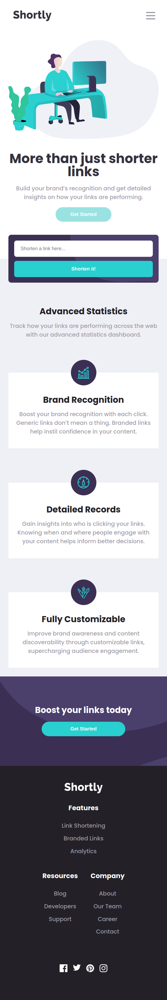

# Frontend Mentor - Shortly URL shortening API Challenge solution

This is a solution to the [Shortly URL shortening API Challenge challenge on Frontend Mentor](https://www.frontendmentor.io/challenges/url-shortening-api-landing-page-2ce3ob-G). Frontend Mentor challenges help you improve your coding skills by building realistic projects. 

## Table of contents

- [Overview](#overview)
  - [The challenge](#the-challenge)
  - [Screenshot](#screenshot)
  - [Links](#links)
- [My process](#my-process)
  - [Built with](#built-with)
  - [What I learned](#what-i-learned)
- [Author](#author)

## Overview

With this project I wanted to challenge myself with React and async API call.
Despite an issue that blocked me for a while I have managed to complete this project.
### The challenge

Users should be able to:

- View the optimal layout for the site depending on their device's screen size
- Shorten any valid URL
- See a list of their shortened links, even after refreshing the browser
- Copy the shortened link to their clipboard in a single click
- Receive an error message when the `form` is submitted if:
  - The `input` field is empty

### Screenshot

### Links

- GitHub : [GitHub Code](https://github.com/Poukame/ALL-my-Front-End-Mentor-Challenge/tree/main/FEM%20-%20url-shortening-api)
- Live Site URL: [My live site of the challenge](https://loquacious-madeleine-a87fed.netlify.app/)

## My process

I use the mobile first approach and did the mobile then the desktop layout before anything else.

Then I focused on the interactivity part with React. The part that gave me a hard time was to trigger a render to display the link after the click AND the fetch.

### Built with

- React
- TypeScript
- Vite
- HTML5
- CSS3
- Flexbox
- Grid
- Mobile-first workflow

### What I learned

I learned more about the React logic. As I was reading and learning about it as part of my learning I got new knowledge and would probably not struture this project the way I did.

Knowledge for a future project :)

## Author

- GitHub - [Poukame](https://github.com/Poukame)
- Frontend Mentor - [@Poukame](https://www.frontendmentor.io/profile/Poukame)
- LinkedIn - [Guillaume](https://www.linkedin.com/in/theretg)
